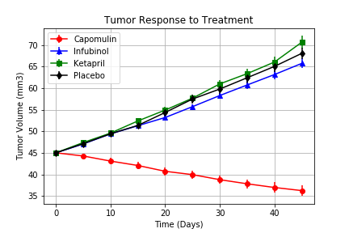
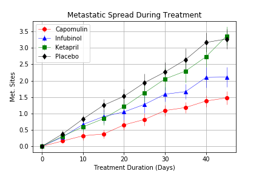
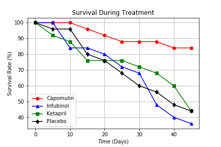
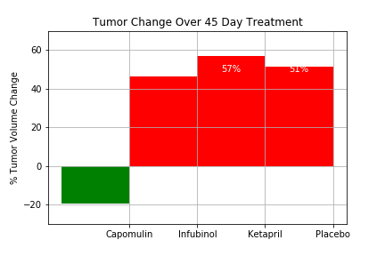

# Observations of the Tumor Data

<h1> Final Conclusions </h1>

Of the three most promising drugs administered Stelasyn, Naftisol, Ketapril, and Capomulin  over a 45-day period (With placebo data used as a control) four observations indicate that Capomulin was far and away the most effective.

Over a 45 day span tumor volume growth shrank by nearly 10 cubic millimeters as evidenced by the tumor response to treatment line chart in Figure 1:

There was a 200% reduction in spread of metastatic sites during treatment  when compared between Capomulin and the worst-performing drug Ketapril and placebo.
See Figure 2:

Survival rates during treatment were nearly 85% when treated with Capomulin compared to a less than 50% chance of survival with the other treatments.
See figure 3:

Capomulin was the only treatment to show tumor volume reduction over the 45-day treatment ss evidenced by figure 4:

In Conclusion it is recomended to move forward with Capomulin. 
